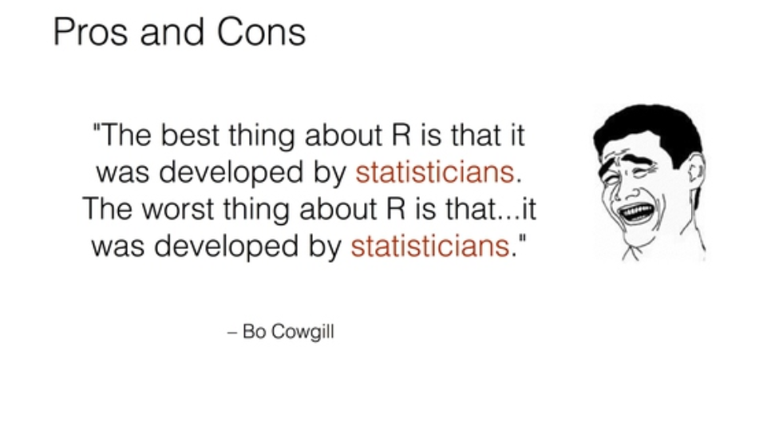

class:  inverse,center, middle
```{r xaringan-logo, echo=FALSE}
xaringan_logo <- file.path(
  "gylogo.png"
)
xaringanExtra::use_logo(xaringan_logo)
```

# 欢迎来到R语言的世界！


---
## R 的简介

- ### R语言由新西兰奥克兰大学的 Ross Ihaka 和 Robert Gentleman 两人共同发明。
- ### 其词法和语法分别源自 Scheme 和 S 语言，R 语言一般认为是 S 语言（John Chambers, Bell Labs, 1972）的一种方言。
- ### R 是“GNU S”， 一个自由的、有效的、用于统计计算和绘图的语言和环境，它提供了广泛的统计分析和绘图技术。

---
## R的历史

-   2000年，R1.0.0 发布
-   2004年，第一届国际useR!会议（随后每年举办一次）
-   2005年，ggplot2宏包（2018.8 - 2019.8下载量超过 1.3 亿次）
-   2012年，R2.15.2 发布
-   2013年，R3.0.2 发布, CRAN上的宏包数量5026个
-   2016年，Rstudio公司推出 tidyverse 宏包（数据科学当前最流行的R宏包）
-   2017年，R3.4.1 发布，CRAN上的宏包数量10875个
-   2019年，R3.6.1 发布，CRAN上的宏包数量15102个
-   2020年，R4.0.0 发布，CRAN上的宏包数量16054个
-   2022年，R4.2.1 发布， CRAN上的宏包数量18554个


---

##  R 语言的四个优势 (Norm Matloff)

- ###为统计学家打造

- ###矩阵操作非常高效

- ###强大的绘图功能

- ###优秀的并行能力

---

## R 的笑话



---

## R的缺点

- ###  18000+ 的包
- ###  40多年的历史
- ###  学习曲线陡峭（跟python相比）


---


#  R 软件的安装

- ###安装R 4.2.1版


- ###安装Rstudio


---


## 练习

```{r, eval=FALSE, include=T}
install.packages("swirl")
library(swirl)
install_from_swirl("R Programming")
swirl()
```

---
