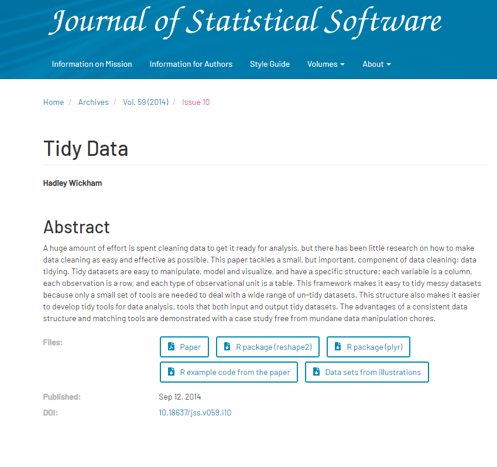
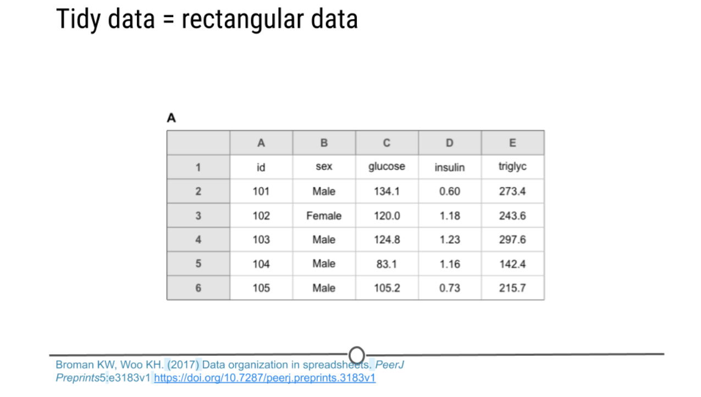

```{r xaringan-logo, echo=FALSE}
xaringan_logo <- file.path(
  "gylogo.png"
)
xaringanExtra::use_logo(xaringan_logo)
```


```{r setup, include=FALSE}
options(htmltools.dir.version = FALSE)
```


---
# Tidyvse 是什么？

- ### Tidyverse是由R语言大神Hadley Wickham开发的一系列用于**数据科学**的R语言包集合。
- ###包括的包主要有ggplot2，dplyr，tidyr，readr，purrr，tibble，stringr， forcats。

- https://tidyverse.tidyverse.org/

---

- ###Tidyverse涵盖了数据科学的整个工作流程。即数据导入、数据清洗、数据变换、数据可视化、数据建模以及文档沟通。
.pull-left[
- ###数据科学
  - ggplot：数据可视化。
  - dplyr：数据操作。
  - tidyr：数据清洗。
  - purrr：函数化编程。
  - tibble：对数据框重构。
  - stringr：处理字符串。
  - hms：处理时间数据。
  - lubridate：处理日期时间。
  - modelr：用于管道内建模。
  - broom：模型简洁化。
]

.pull-right[
- ###数据读取
  - readr：读入csv、tsv和fwf文件。
  - readxl：读入.xls和.xlsx数据
  - haven：读入SAS、SPSS、Stata等外部数据。
  - httr：与web交互的APIs。
  - rvest：网页爬虫。
  - xml2：读入XML文件。
  - DBI：读取关系型数据库。feather：用于与Python及其他语言共享。

]


---
class: inverse, middle, center


# 什么是tidy data？


---

- ###Hadley Wickham 在2014年 对tidy data是这样定义的：
--
.pull-left[
```{r, out.width = '105%', fig.align='center', echo = FALSE, fig.cap=''}

```
]
--
.pull-right[
- ### 每列只有一个变量
- ### 不同观测在不同的行
- ### 不同数据在不同的表
- ### 不同的表有唯一id列
]

---
# 整洁的数据就是方形数据

-- 

```{r, out.width = '75%', fig.align='center', echo = FALSE, fig.cap=''}

```


---
class: center, middle

# 学习`tibble`


#打开：https://tibble.tidyverse.org/


---
# `Tidyverse`的安装：


```
install.packages("tidyverse")
#require("tidyverse")
```

--

# `Tidyverse` 的练习，熟悉`tibble`和`tidyr`的用法


```
# Install Swirl
install.packages("swirl")
library(swirl)

# Install the Tidyswirl course
install_course_github("matt-dray", "tidyswirl")

# Start Swirl
# Tidyswirl will be one of the course options
swirl()
```

---

class: center, middle

# 蟹蟹大噶


