---

# 課程安排

- ###第一講：基本原理；參數估計；單變量描述性分析
- ###第二講：假設檢驗；t檢驗；方差分析
- ###第三講：卡方檢驗和非參數檢驗
- ###第四講：相關與回歸，多變量分析

---
##參考教材（可選）
###《醫學統計學》
###人民衛生出版社 （第7版）主編： 李康、賀佳

```{r, out.width = '35%', fig.align='center', echo = FALSE, fig.cap=''}
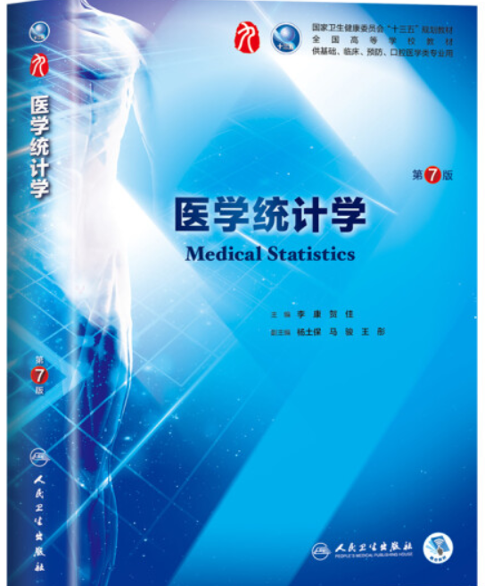
```


---
#今天主要内容

- ###醫學統計學的基本定義

- ###單變量描述行分析

- ###SPSS的基本操作

- ### 中期教學檢驗

---
class: inverse, center, middle

## 爲什麽要學習統計學

---
class: inverse, center, middle

# 什麽是科學的問題？

--
# <font color='red'>証僞性</font>

--
# <font color='red'>假設檢驗的證僞系統</font>

---

##醫學論文中關於統計學P值使用的爭議


```{r, out.width = '105%', fig.align='center', echo = FALSE, fig.cap=''}
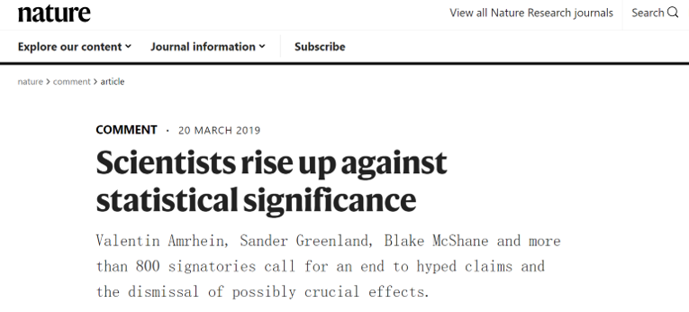
```
---

## 爭論的結果

- ###反對者：“P值就是是個屁！”
- ###支持者：“論文中，沒有P值，連屁都不是！”

- ###假設檢驗是至今爲止最有效的證僞系統

- 參考：https://statmodeling.stat.columbia.edu/2019/03/20/retire-statistical-significance-the-discussion/
---
class: inverse, center, middle

# 爲什麽要學習統計

http://opinion.people.com.cn/n1/2017/0609/c1003-29327938.html

```{r, out.width = '35%', fig.align='center', echo = FALSE, fig.cap=''}

```


---

class:  center, middle

```{r, out.width = '85%', fig.align='center', echo = FALSE, fig.cap=''}
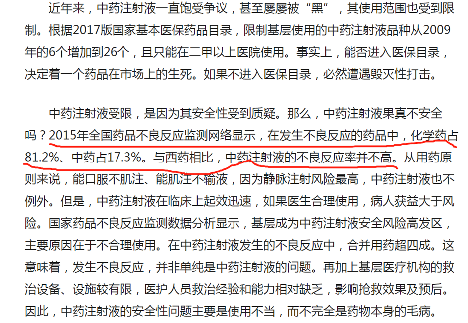
```
---
## 醫學統計學的定義

###醫學統計學(medical statistics):臨床醫學、基礎醫學、公共衛生學和醫療衛生服務服務研究中的一門**基礎學科**，是關於搜集數據、分析數據和由數據得出結論的一組概念、原則和方法。 

---
## 學習醫學統計學的目的

- ### 培養正確的統計思維
- ### 掌握基本的統計設計方法和如何收集準確可靠的數據
- ### 運用基本統計分析方法正確分析和處理數據
- ### 掌握操作統計軟件的基本技能
- ### 正確解釋和表達分析結果

---

class: inverse, center, middle

# 變量和數據類型

---

## **定量數據**：

###也稱計量資料，變量的觀測值是定量的，其特點是能用數值的大小衡量其水平的高低，一般有計量單位。

## **定性數據**：

### 也稱計數資料，變量的觀測值是定性的，表現為互不相容的類別或屬性。血型分爲A、B、O、AB

---
## 有序數據:

### 也稱半定量數據或等級資料。變量的觀測值是定性的，但各類別（屬性）之間有程度或順序上的差別，如尿糖的化驗結果分爲-、+、++、+++。

##<font color='red'>統計方法的選用與數據類型有密切關係。根據分析的需要，不同類型的變量或數據之家可以進行轉換。</font>

---

class: inverse, center, middle
# 數據的描述性分析

---

## 例：140名成年男子紅細胞數


```{r, out.width = '95%', fig.align='center', echo = FALSE, fig.cap=''}
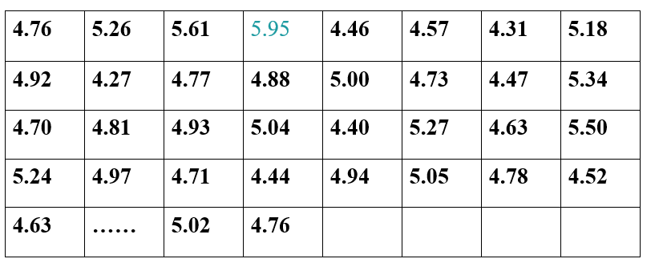
```

- ###目的：了解數據分佈的情況
- ###假定：來自正態分佈 $N(\mu,\sigma^2)$

---

 ## 頻數表

### 確定組數->確定組距-> 確定組限 ->確定頻數

```{r, out.width = '95%', fig.align='center', echo = FALSE, fig.cap=''}
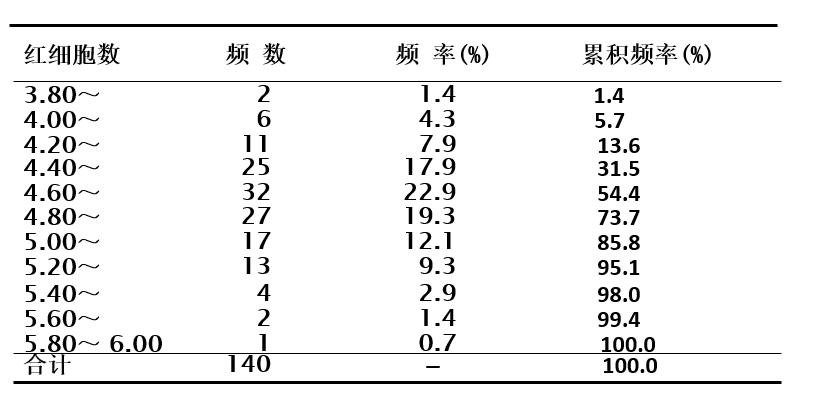
```
---
## 直方圖


```{r, out.width = '95%', fig.align='center', echo = FALSE, fig.cap=''}
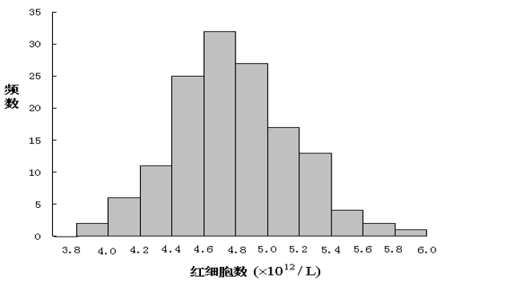
```

---
## 集中趨勢的指標

- ###算術均值（mean）： $\bar X(\mu)$
- ###中位數（median）:  $M$
- ###百分位數（percentile）
- ###衆數（mode）
---
## 離散趨勢的指標
- ###極差（range）: R
- ###四分位間距 （interquantile range，IQR）
- ###方差（variance） ： $S^2(\sigma^2)$
- ###標準差（standard deviation S.D.）: $S(\sigma)$
- ###變異係數(coefficient of variation, C.V.): 標準差/算術均值

---
class: inverse,middle,center

## 使用SPSS繪製140名成年男子紅細胞數的頻數表和直方圖並計算上述各個指標

---
##如何描述定量變量

- ###判斷是否正態分佈
- ###具體方法：頻數表、直方圖、QQ圖、正態檢驗
- ###準則：
  - ####正態分佈：均值（標準差）
  - ####非正態分佈：中位數（四分位間距）

---

class: inverse, center, middle
# 正態分佈

```{r, out.width = '55%', fig.align='center', echo = FALSE, fig.cap=''}
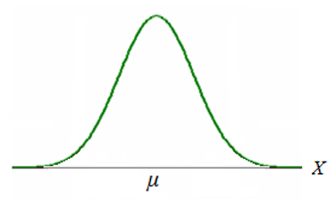
```

---
class:center,middle

```{r, out.width = '105%', fig.align='center', echo = FALSE, fig.cap=''}
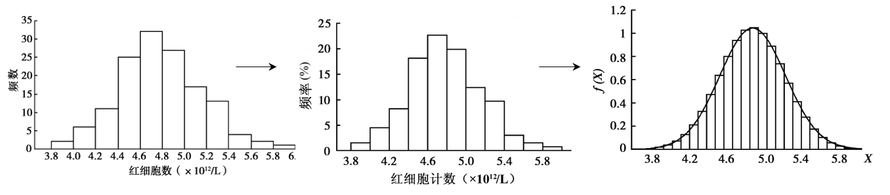
```

### 某地正常成年男子紅細胞數的分佈情況
---
### 連續型隨機變量X服從正態分佈: $X\sim N(\mu,\sigma^2)$ 

```{r, out.width = '55%', fig.align='center', echo = FALSE, fig.cap=''}

```

### 單峰鈡型分佈，以 $X=\mu$為對稱中心

### 在 $X=\mu \pm \sigma$ 有拐點

---
class: center

### $\mu$ 是位置參數， $\sigma$是形狀參數

```{r, out.width = '45%', fig.align='center', echo = FALSE, fig.cap=''}
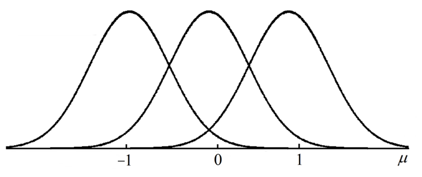
```

```{r, out.width = '45%', fig.align='center', echo = FALSE, fig.cap=''}
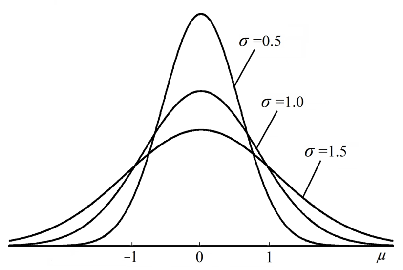
```

---
class: center

## 密度曲綫下方的面積含義

```{r, out.width = '65%', fig.align='center', echo = FALSE, fig.cap=''}
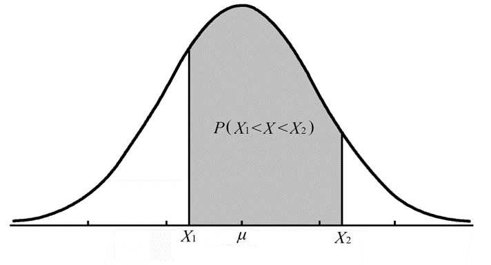
```

### $P(X_1<X<X_2)$

---

class: center

## 正態分佈密度曲綫的分佈律

```{r, out.width = '75%', fig.align='center', echo = FALSE, fig.cap=''}
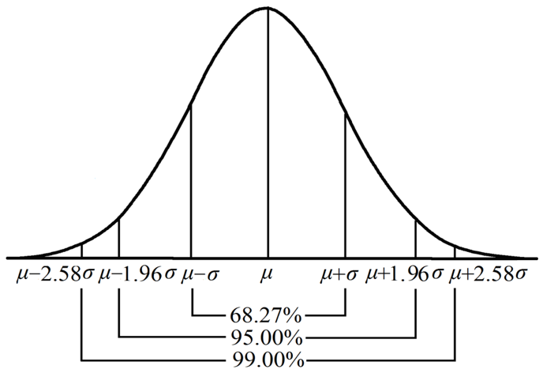
```

---

class:center

## 標準正態分佈


### $\mu=0,\sigma=1$時: $Z\sim N(0,1)$


```{r, out.width = '85%', fig.align='center', echo = FALSE, fig.cap=''}
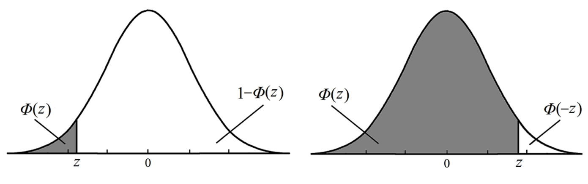
```

### 標準化： $z=\frac{X-\mu}{\sigma}$

---
###已知某地140名成年男子紅細胞計數近似服從正態分佈: 
### $\bar{X}=4.78 \times 10^{12}/L$ , $S=0.38\times 10^{12}/L$ 求：
- ###計算該地正常成年男子紅細胞計數在 $4.0\times 10^{12}/L$以下者佔該地正常成年男子總數的百分比。
- ###計算紅細胞計數在 $4.0\times 10^{12}/L\sim 5.5\times 10^{12}/L$ 佔該地正常成年男子總數的百分比。

---
class: inverse,center,middle

## 醫學論文中常用的分析方法

---
class: center

## 單因素分析


```{r, out.width = '95%', fig.align='center', echo = FALSE, fig.cap=''}
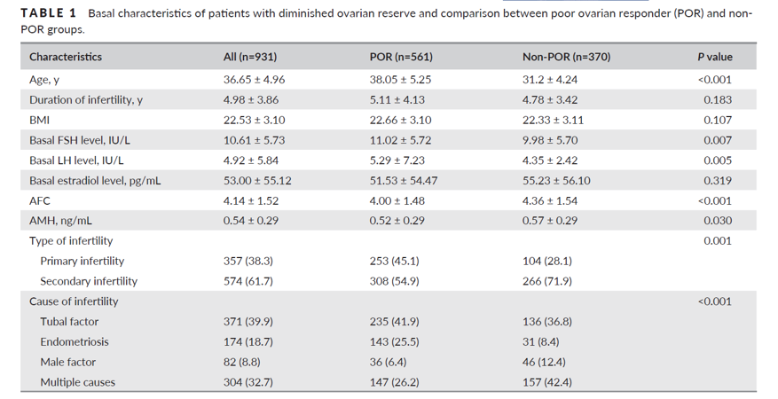
```


https://obgyn.onlinelibrary.wiley.com/doi/10.1002/ijgo.13174

---

## 單因素分析


```{r, out.width = '95%', fig.align='center', echo = FALSE, fig.cap=''}
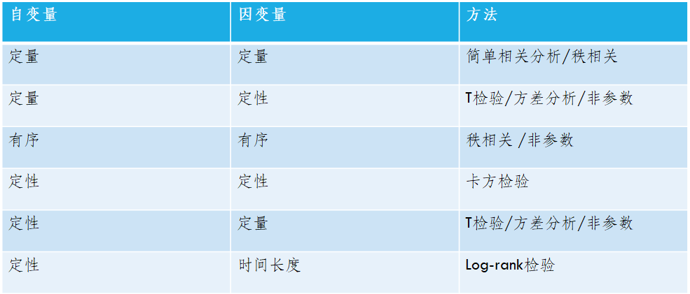
```

---
## 多因素分析

- ### 多重綫性回歸模型
- ### logistics 回歸模型

<font color='red'>
- ### 泊松回歸
- ### cox回歸

---

## 多因素分析


```{r, out.width = '95%', fig.align='center', echo = FALSE, fig.cap=''}
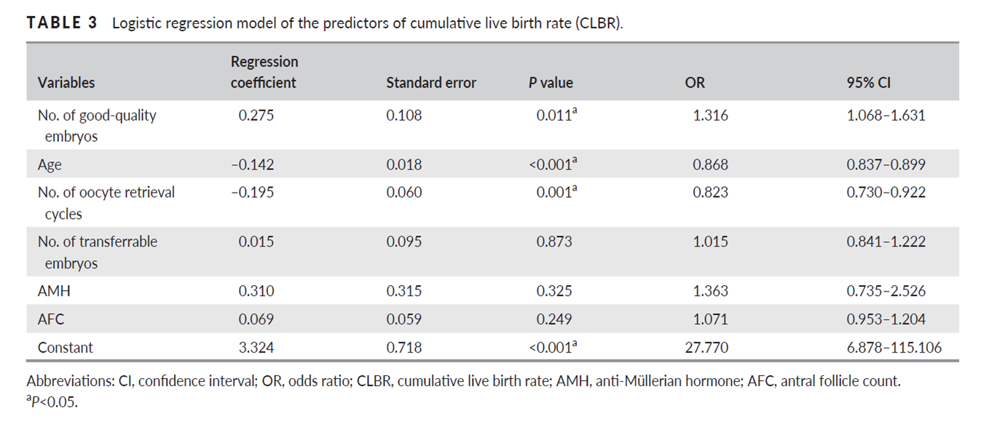
```


https://obgyn.onlinelibrary.wiley.com/doi/10.1002/ijgo.13174

---
class: inverse,center,middle

# 謝謝大家
