```{r setup, include=FALSE}
options(htmltools.dir.version = FALSE)
```

---
## 主要内容

- ###參數估計
- ###假設檢驗
- ###t檢驗
- ###方差分析

---


##統計推斷

- ### 參數估計
  - ###點估計
  - ###區間估計


- ### 假設檢驗

---
class: inverse, center, middle
## 參數估計
---

## 基本統計概念

-  ###總體： $X\sim N(\mu,\sigma^2)$
-  ###樣本： $X_1,X_2,\cdots,X_n\sim N(\mu,\sigma^2)$
-  ###統計量： $\bar{X},S$ （點估計）
-  ###如何估計 $\mu$ ?
--

-  ###用樣本均值 $\bar{X}$ 估計 $\mu$

--
-  ###樣本均值的標准差（標準誤）：   $S_\bar{X}=\frac{\sigma}{\sqrt{n}}$

---
## 抽樣誤差

- ### 樣本均值的標準差也稱爲**抽樣誤差**
- ### 抽樣誤差的大小反映 $\bar{X}$估計參數 $\mu$的波動
- ### $S_\bar{X}=\frac{\sigma}{\sqrt{n}}$
- ### 實際應用中： $S_\bar{X}=\frac{S}{\sqrt{n}}$

---

## 【例】求140名成年男子紅細胞數目的抽樣誤差（標准誤）
- ### $\bar{X}=4.77$， $S=0.38$
- ### $S_\bar{X}=\frac{S}{\sqrt{n}}=\frac{0.38}{\sqrt{140}}=0.032$
---
## 可信區間（區間估計）

- ### 點估計： $\hat{\mu}=\bar{X}$
- ### 區間估計： 按照預先給定的概率，計算出一個區間，能夠包含 $\mu$
- ### 事先給定的概率稱爲可信度，計算的區間成爲可信區間（confidence interval, CI）
- ### 一般求95%的區間估計

---
class:center
## $\mu$的區間估計（假定 $\sigma$已知情形）

###$$\bar{X}\sim N(\mu,\frac{\sigma^2}{n})$$
--
```{r, out.width = '65%', fig.align='center', echo = FALSE, fig.cap=''}
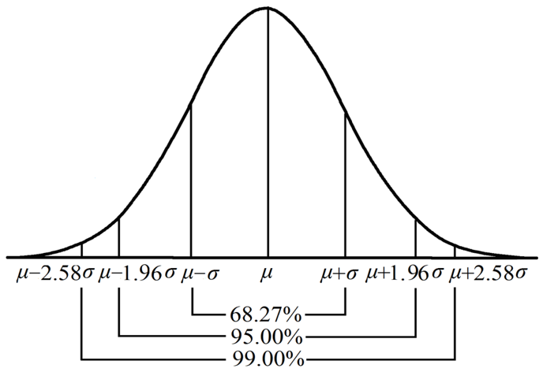
```
---
class:center
###$$P(\mu-1.96\frac{\sigma}{\sqrt{n}}<\bar{X}<\mu+1.96\frac{\sigma}{\sqrt{n}})=0.95$$
--

###  $\sigma$已知時， $\mu$ 的區間估計：$$(\bar{X}-1.96\frac{\sigma}{\sqrt{n}},\bar{X}+1.96\frac{\sigma}{\sqrt{n}})$$

--
###  $\sigma$未知時，是否就是：
### $$(\bar{X}-1.96\frac{S}{\sqrt{n}},\bar{X}+1.96\frac{S}{\sqrt{n}})$$

---

###$$\frac{\bar{X}-\mu}{S/\sqrt{n}}\sim t(n-1)$$


```{r, out.width = '95%', fig.align='center', echo = FALSE, fig.cap=''}
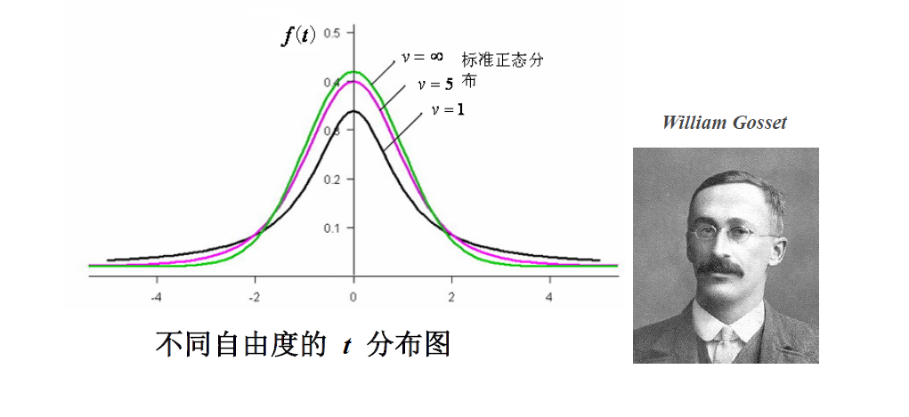
```
---
### $$P(-t_{0.05/2}<\frac{\bar{X}-\mu}{S/\sqrt{n}}<t_{0.05/2}=0.95$$

### $$P(\bar{X}-t_{0.05/2}S_{\bar{X}}<\mu<\bar{X}+t_{0.05/2}S_{\bar{X}})=0.95$$
### $\mu$的95%可信區間：
### $$(\bar{X}-t_{0.05/2}S_{\bar{X}}，\bar{X}+t_{0.05/2}S_{\bar{X}})$$
### 大樣本時： $t_{0.05/2}$約等於 $1.96(Z_{0.05/2})$

---
## 【例】求上例中，成年男子紅細胞數總體均值的95%可信區間。 $$\bar{X}=4.77， S=0.38$$

- ### 方法壹：利用t分佈，
### $$\bar{X}-t_{0.05/2}S_{\bar{X}}=4.77-1.98\times 0.03=4.71$$
--

### $$\bar{X}+t_{0.05/2}S_{\bar{X}}=4.77+1.98\times 0.03=4.83$$

---
##【例續】

- ###方法貳：


### $$\bar{X}-z_{0.05/2}S_{\bar{X}}=4.77-1.96\times 0.03=4.71$$
--

### $$\bar{X}+z_{0.05/2}S_{\bar{X}}=4.77+1.96\times 0.03=4.83$$

---

class:  inverse, center, middle

## 假設檢驗

---

## 假設檢驗的基本原理

- ### 關於總體參數的推斷
--

- ### 小概率事件原理

--
- ### 例：已知成年男子紅細胞數目均值為 $4.75\times$ $10^{12}$/L，某地抽取140個樣本，問此地的成年男子紅細胞數目是否達到均值水平？

---

## 基本步驟

- ###1、 建立檢驗假設，確定檢驗水準 
  - #### $H_0$: $\mu_0=4.75$ 此地的成年男子紅細胞數目的總體均值為4.75
  - #### $H_1$: $\mu_0\ne 4.75$
  - #### $\alpha = 0.05$
- ###2、 計算檢驗統計量：$$T=\frac{\bar{X}-\mu_0}{S/\sqrt{n}}\sim t(n-1)$$
  
---
- ###2、續：帶入140樣本信息，可以算出： $$T=0.823\sim t(139)$$
- ###3、計算P值，做出結論
  - #### P值：檢驗統計量不利於原假設的概率
  - #### P=0.412大於0.05，在0.05的檢驗水平下，不能拒絕原假設
  - #### 結論：不能拒絕此地的成年男子紅細胞數目已達到均值水平
```{r, out.width = '85%', fig.align='left', echo = FALSE, fig.cap=''}
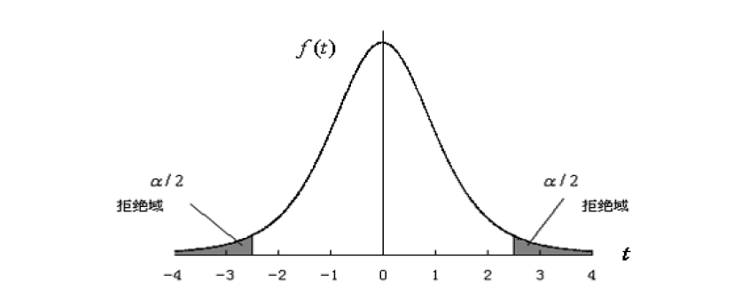
```

---
class:  inverse, center, middle

#t檢驗

---
## t檢驗的分類

- ### 單樣本的t檢驗
- ### 配對樣本t檢驗
- ### 獨立樣本t檢驗

---
## 配對樣本t檢驗

>### 【例】某项研究评估咖啡因对运动者的心肌血流量的影响，先后测定了12名男性志愿者饮用咖啡前后运动状态下的心肌血流量，数据如下表所示，问饮用咖啡前后运动者的心肌血流量有无差异。

---
## 【例】續
```{r, out.width = '35%', fig.align='center', echo = FALSE, fig.cap=''}
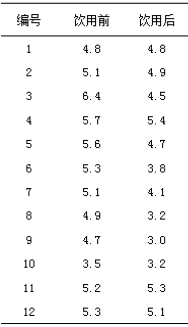
```

---

## 配對t檢驗步驟

- ### 建立檢驗假設，確定檢驗水準
  - #### $H_0$: $\mu_d=0$ 飲用咖啡前後運動者的平均心肌血流量差異的總體均值為零
  - #### $H_1$: $\mu_d\ne 0$ 飲用咖啡前後運動者的平均心肌血流量差異的總體均值不為零
  - #### $\alpha=0.05$  
- ### 計算檢驗統計量 $$T=\frac{\bar{d}-\mu_d}{S_{\bar d}}=3.74\sim t(11)$$

---
## 【續】

- ### 計算P值，做出結論
  - #### P=0.003小於0.05，在0.05的檢驗水平下，拒絕原假設，接受備擇假設
  - #### 結論：兩種環境中運動者的心肌血流量有差異，引用前大於引用后


---
## 獨立樣本t檢驗

>###【例】某項研究評估低氧環境（模擬高原環境）對運動者的心肌血流量的影響，將17名男性志願者隨機分成兩組，分別在正常含氧環境（正常組）和低氧環境（低氧組）中測定運動後的心肌血流量，數據如下表所示，問兩種環境中運動者的心肌血流量有無差異。

---
## 【例】續

```{r, out.width = '75%', fig.align='center', echo = FALSE, fig.cap=''}
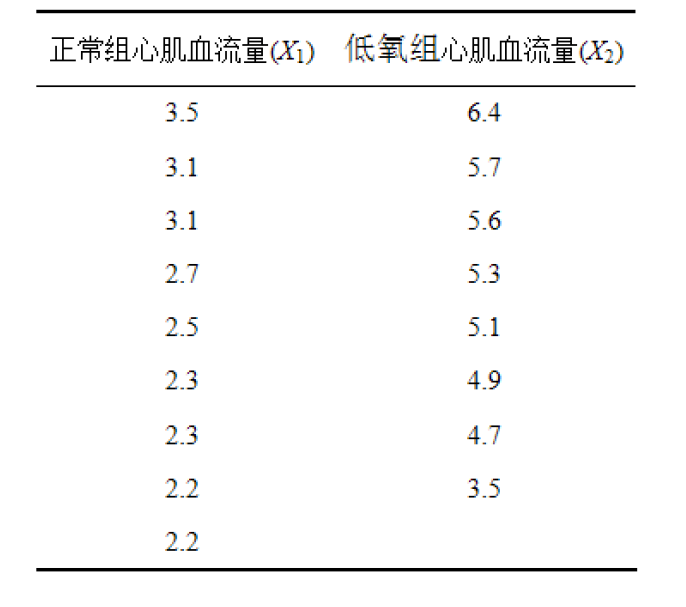
```

---
## t檢驗的假定

- ### 樣本來自正態分佈
- ### 獨立樣本t檢驗：兩組的總體方差相同
- ### 方差齊性檢驗

---
## 檢驗方差齊性
- ### 如果方差齊性條件不滿足
--

- ### 辦法一： $t'$ 檢驗
--

- ### 辦法二：非參數檢驗

---

## 獨立樣本t檢驗步驟

- ### 建立檢驗假設，確定檢驗水準
  - #### $H_0$: $\mu_1=\mu_2$ 兩種環境中運動者的心肌血流量的總體均數相同
  - #### $H_1$: $\mu_1\ne\mu_2$ 兩種環境中運動者的心肌血流量的總體均數不同
  - #### $\alpha=0.05$  
- ### 計算檢驗統計量 $$T=-7.579\sim t(15)$$

---
## 【續】

- ### 計算P值，做出結論
  - #### P=0.000小於0.05，在0.05的檢驗水平下，拒絕原假設，接受備擇假設
  - #### 結論：兩種環境中運動者的心肌血流量的總體均數不同，正常組小於低氧組

---

###【例】兩組小白鼠分別飼以高蛋白和低蛋白飼料，4週後記錄小白鼠體重增加量(g)如下表所示，問兩組動物體重增加量的均數是否相等。


```{r, out.width = '75%', fig.align='center', echo = FALSE, fig.cap=''}
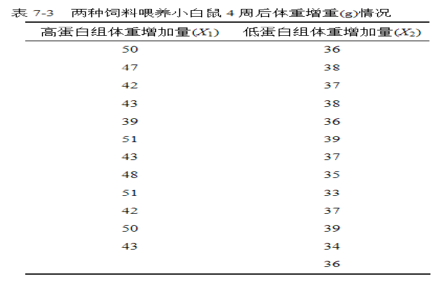
```
---


## 獨立樣本 $t'$ 檢驗步驟

- ### 建立檢驗假設，確定檢驗水準
  - #### $H_0$: $\mu_1=\mu_2$ 即兩種飼料小白鼠增重總體均數相同
  - #### $H_1$: $\mu_1\ne\mu_2$ 即兩種飼料小白鼠增重總體均數不同
  - #### $\alpha=0.05$  
- ### 計算檢驗統計量 $$T’=7.017\sim t(14.688)$$

---
## 【續】

- ### 計算P值，做出結論
  - #### P=0.000小於0.05，在0.05的檢驗水平下，拒絕原假設，接受備擇假設
  - #### 結論：兩種飼料小白鼠增重總體均數不同，高蛋白組體重增加量更多


---
## 假設檢驗的兩類錯誤


```{r, out.width = '85%', fig.align='left', echo = FALSE, fig.cap=''}
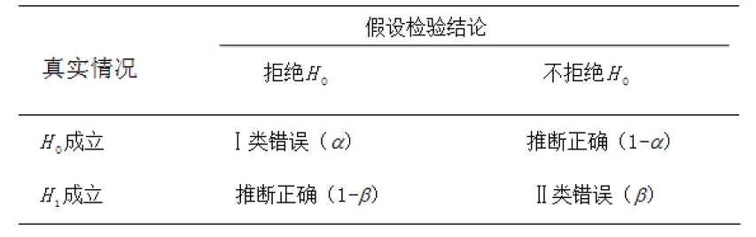
```


- ### 假設檢驗的功效
- ### 影響假設檢驗功效的因素：樣本量

---

class:  inverse, center, middle


#方差分析

---

## 完全隨機設計的方差分析

- ### 完全隨機設計(completely randomized design):將實驗對象隨機分到不同處理組的單因素設計方法。
- ### 考察一個處理因素，通過對該因素不同水平組均值的比較，推斷它是否起作用。

```{r, out.width = '25%', fig.align='center', echo = FALSE, fig.cap=''}
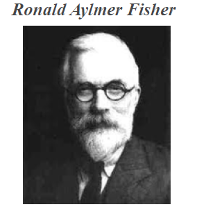
```

---
 
>###【例】在評價某藥物耐受性及安全性的I期臨床試驗中，對符合納入標準的30名健康自願者隨機分為3組每組10名，各組注射劑量分別為0.5U、1U、2U，觀察48小時部分凝血活酶時間（s）試問不同劑量的部分凝血活酶時間有無不同？


```{r, out.width = '55%', fig.align='center', echo = FALSE, fig.cap=''}
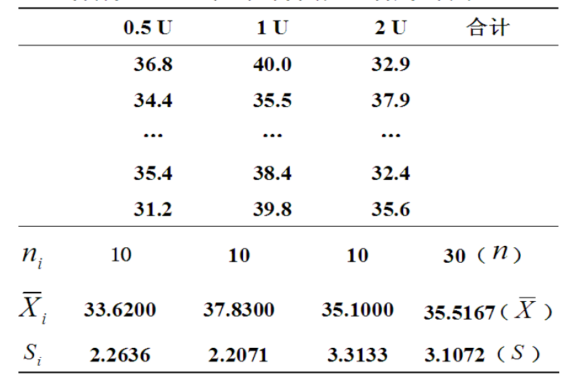
```

---

### $$SS_{縂變異}=SS_{組間}+SS_{組内}$$
### $$v_{縂變異}=v_{組間}+v_{組内}$$
### $$MS_{組間}=\frac{SS_{組間}}{v_{組間}}$$
### $$MS_{組内}=\frac{SS_{組内}}{v_{組内}}$$
### $$F=\frac{MS_{組閒}}{MS_{組内}}\sim F(k-1,n-k)$$

---
class: center

## F分佈

```{r, out.width = '95%', fig.align='center', echo = FALSE, fig.cap=''}
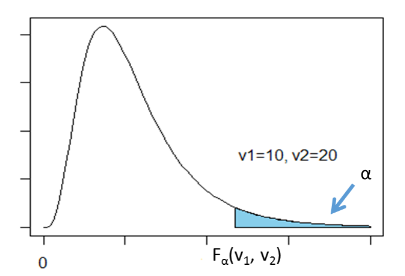
```

---
## 完全隨機設計的方差分析的假設檢驗

- ### 建立檢驗假設，確定檢驗水準
  - #### $H_0$: $\mu_1=\mu_2=\mu_3$ 
  - #### $H_1$: $\mu_1,\mu_2,\mu_3不全相同$ 
  - #### $\alpha=0.05$  
- ### 計算方差分析表

---
## 方差分析表

```{r, out.width = '95%', fig.align='center', echo = FALSE, fig.cap=''}
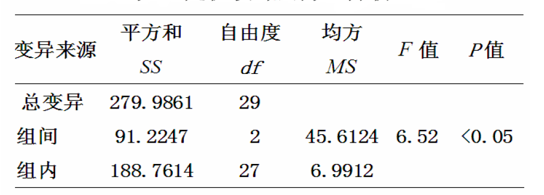
```

- ### 根據P值，做出結論
  - #### P小於0.05，在0.05的檢驗水平下，拒絕原假設，接受備擇假設
  - #### 結論：不同劑量的部分凝血活酶時間不全相同

---
## 隨機區組設計方差設計

- ### 又稱配伍因素方差設計
- ### 先將受試對象按條件相同或相近組成m個區組(或稱配伍組)，每個區組中有k個受試對象，再將其隨機地分到k個處理組中

---


### $$SS_{縂變異}=SS_{處理}+SS_{區組}+SS_{誤差}$$
### $$v_{縂變異}=v_{處理}+v_{區組}+v_{誤差}$$
### $$MS_{處理}=\frac{SS_{處理}}{v_{處理}},F=\frac{MS_{處理}}{MS_{誤差}}$$
### $$MS_{區組}=\frac{SS_{區組}}{v_{區組}},F=\frac{MS_{區組}}{MS_{誤差}}$$
### $$MS_{誤差}=\frac{SS_{誤差}}{v_{誤差}}$$

---
class: center,middle
>###【例】為探討Rgl 對鎘誘導大鼠睾丸損傷的保護作用，研究者按照窩別把大鼠分成10個區組，然後將同一區組內的3隻大鼠隨機地分配到三個實驗組，分別給與不同處理，一定時間後測量大鼠的睾丸MT含量（μg/g），數據如下表所示。試比較三種不同處理對大鼠MT含量有無差別？

---
```{r, out.width = '95%', fig.align='center', echo = FALSE, fig.cap=''}
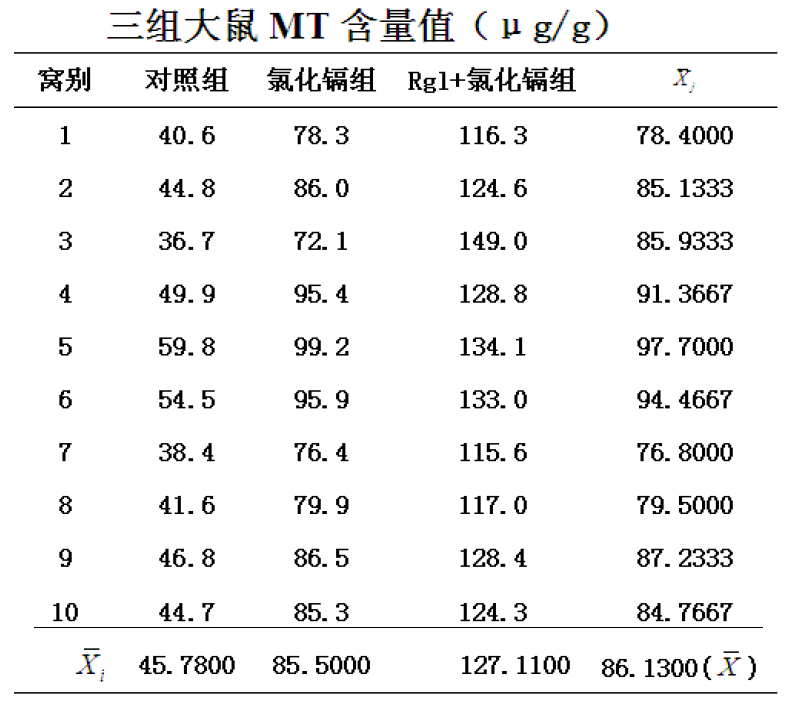
```

---
## 區組設計方差分析的假設檢驗

- ### 建立檢驗假設，確定檢驗水準
  - #### $H_0$: $\mu_1=\mu_2=\mu_3$ 
  - #### $H_1$: $\mu_1,\mu_2,\mu_3不全相同$ 
  - #### $\alpha=0.05$  
- ### 計算方差分析表

---
## 方差分析表

```{r, out.width = '95%', fig.align='center', echo = FALSE, fig.cap=''}
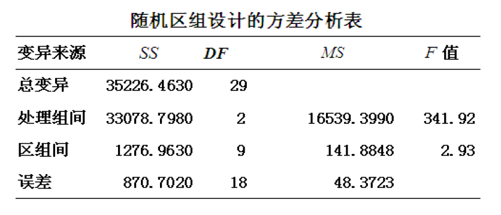
```

- ### 根據P值，做出結論
  - #### P小於0.05，在0.05的檢驗水平下，拒絕原假設，接受備擇假設
  - #### 結論：三組大鼠MT含量的總體均值不全相同

---
class: inverse, center, middle

#謝謝！


