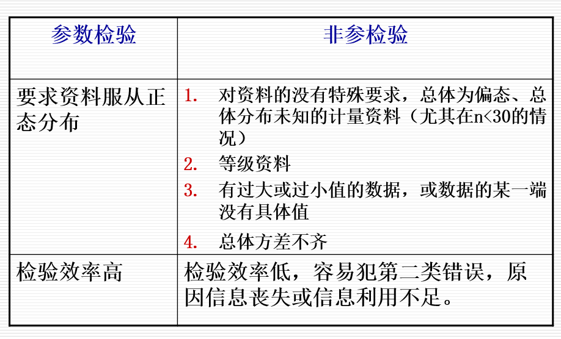

```{r setup, include=FALSE}
options(htmltools.dir.version = FALSE)
```

## 主要内容

- ###非參數檢驗
  - ####配對樣本秩和檢驗
  - ####獨立樣本秩和檢驗
  - ####多組樣本秩和檢驗

- ###卡方檢驗
  - #### 獨立四個表
  - #### 配對四格表
  - #### R $\times$C 列聯表

---
## 參數檢驗和非參數檢驗

```{r, out.width = '95%', fig.align='center', echo = FALSE, fig.cap=''}

```


---

- ### 參數檢驗
  - ####正態總體
  - ####方差齊性

- ### 非參數檢驗
  - ####對分佈不做假定
  - ####不對總體參數進行推斷
  - #### 對總體的分佈或分佈位置進行檢驗

---

## 參數檢驗與非參數檢驗比較


```{r, out.width = '95%', fig.align='center', echo = FALSE, fig.cap=''}

```

---

class: inverse, center, middle
## 配對資料符號秩和檢驗（Wilcoxon signed rank test）

---
###符號秩和檢驗的一般步骤
- ### 建立檢驗假設，確定檢驗水準
  - #### $H_0$: 差值的總體中位數為0；
  - #### $H_1$: 差值的總體中位數不為0；
  - #### $\alpha=0.05$  
- ### 計算檢驗統計量
  - #### 算出對子差值
  - #### 根據差值的絕對值大小編秩
  - ####  將秩次冠以正負號，計算正、負秩和
  - ####  用不為“0”的對子數和 絕對值較小的秩和作爲統計量

---
## 

>### 【例】臨床某醫生研究白癜風病人的白介素IL-6水平（u/ml）在白斑部位與正常部位有無差異，調查的資料如下表

```{r, out.width = '95%', fig.align='center', echo = FALSE, fig.cap=''}

```
---

###本例一般步骤
- ### 建立檢驗假設，確定檢驗水準
  - #### $H_0$: 差值的總體中位數為0；
  - #### $H_1$: 差值的總體中位數不為0；
  - #### $\alpha=0.05$  
- ### 計算檢驗統計量
 - ####絕對值較小的秩和 $T=3$ 作爲統計量, $n=8$
- ### 根據P值，做出結論
  - #### 根據SPSS軟件結果， $P<0.05$, 在0.05的檢驗水平下，拒絕原假設，認爲差值的中位數不為0。
---
class: inverse, middle, center
## 兩獨立樣本的秩和檢驗
---

>###【例】对无淋巴细胞转移与有淋巴细胞转移的胃癌患者，观察其生存时间，问两组患者的生存时间是否不同？

```{r, out.width = '55%', fig.align='center', echo = FALSE, fig.cap=''}

```
---
- ### 建立檢驗假設，確定檢驗水準
  - #### $H_0$: 兩總體中位數相同；
  - #### $H_1$: 兩總體中位數不相同；
  - #### $\alpha=0.05$  
- ### 計算檢驗統計量
 - #### 統一編秩，分別求秩和，相同數值取平均秩次，選樣本小的秩和作爲統計量： $T=162$ 
- ### 根據P值，做出結論
  - #### 根據SPSS軟件結果， $P<0.05$，在0.05的檢驗水平下拒絕原假設，認爲兩總體中位數不相同。
---


>###【例】44 例健康人与24例慢性气管炎病人痰液嗜酸性粒细胞数的测量值( $10^6$ /L)，问健康人与慢性气管炎病人痰液嗜酸性粒细胞数有无显著差别？

```{r, out.width = '85%', fig.align='center', echo = FALSE, fig.cap=''}

```
---

- ### 建立檢驗假設，確定檢驗水準
  - #### $H_0$: 兩總體中位數相同；
  - #### $H_1$: 兩總體中位數不相同；
  - #### $\alpha=0.05$  
- ### 計算檢驗統計量
 - #### 統一編秩，分別求秩和，相同數值取平均秩次，選樣本小的秩和作爲統計量： $T=560.5$ 
- ### 根據P值，做出結論
  - #### 根據SPSS軟件結果， $P<0.05$，在0.05的檢驗水平下拒絕原假設，認爲兩總體中位數不相同。
---
class: inverse, center, middle

##多組獨立樣本的秩和檢驗（Kruskal-Wallis 法）

---

>###【例】研究白血病時，測定四組鼠脾DNA的含量，結果列於下表，試分析各組DNA含量有無差別?

```{r, out.width = '95%', fig.align='center', echo = FALSE, fig.cap=''}

```

---


- ### 建立檢驗假設，確定檢驗水準
  - #### $H_0$: 四組鼠脾DNA含量的總體分佈相同；
  - #### $H_1$: 四組鼠脾DNA含量的總體分佈不完全相同；
  - #### $\alpha=0.05$  
- ### 計算檢驗統計量
 - #### 統一編秩，分別求秩和，相同數值取平均秩次，構造H統計量： $H=19.9$ 
- ### 根據P值，做出結論
  - #### 根據SPSS軟件結果， $P<0.05$，在0.05的檢驗水平下拒絕原假設，認爲四組鼠脾DNA含量的總體分佈不完全相同。

---
## 非參數檢驗小結

- ###非參數檢驗在假設檢驗中不對參數作明確的推斷，也不涉及樣本取自何種分佈的總體。它的適用範圍較廣。常用的非參方法較為簡便。易於理解掌握。當資料適用參數檢驗方法時，用非參常會損失部分信息，降低檢驗效能。
- ###秩和檢驗是通過對數據依小到大排列秩次，求秩和來進行假設檢驗的方法，可用於兩獨立樣本比較、配對資料比較、多個獨立樣本比較、隨機配伍組比較等。

---

class: inverse, center, middle


## 卡方檢驗
```{r, out.width = '45%', fig.align='center', echo = FALSE, fig.cap=''}
knitr::include_graphics("fig/fig07.png")
```
---

class: center, middle

###英國統計學家Pearson提出的一種主要用於分析分類變量數據的假設檢驗方法，該方法主要用途是推斷兩個或多個總體率及構成比之間有無差別

---

>###【例】吲達帕胺片治療原發性高血壓療效，將患者隨機分為兩組，試驗組用吲達帕胺片加輔助治療，對照組用安慰劑加輔助治療。試分析有效性。


```{r, out.width = '105%', fig.align='center', echo = FALSE, fig.cap=''}

```

---
- ### 建立檢驗假設並設定檢驗水平
  - #### $H_0$: $\pi_1=\pi_2$
  - #### $H_1$: $\pi_1\ne\pi_2$
  - #### $\alpha=0.05$
- ### 計算卡方檢驗統計量
  - ####卡方統計量： $\chi^2=\sum\frac{(A-T)^2}{T}=8.4\sim\chi^2(1)$
- ### 計算P值，得出結論
  - #### $P<0.05$，拒絕原假設，在0.05的檢驗水平下認爲试验组与对照组的总体有效率不等。
---

## 獨立四個表卡方檢驗的結果選擇

- ### 當 $n\ge 40$且 $T\ge 5$ 時，選擇標準卡方檢驗
- ### 當 $n\ge 40$且 $1\le T< 5$ 時, 選擇校正的卡方檢驗
- ### 當 $n< 40$或 $T< 1$ 時，選擇Fisher 確切概率法
---
>###【例】某醫師欲比較胞磷膽鹼與神經節苷酯治療腦血管疾病的療效，將58例腦血管疾病患者隨機分為兩組，結果見表。問兩種藥物治療腦血管疾病的有效率是否相等？

```{r, out.width = '105%', fig.align='center', echo = FALSE, fig.cap=''}
knitr::include_graphics("fig/fig09.png")
```

---
- ### 建立檢驗假設並設定檢驗水平
  - ### $H_0$: $\pi_1=\pi_2$
  - ### $H_1$: $\pi_1\ne\pi_2$
  - ### $\alpha=0.05$

- ### 選擇Fisher確切概率法的P值，得出結論
  - ### $P<0.05$，拒絕原假設，在0.05的檢驗水平下認爲兩组的总体有效率不等。
---
class: inverse,center, middle

## 配對四個表卡方檢驗

---

>###【例】現有198份痰標本，每份標本分別用A、B兩種培養基培養結核菌，問A、B兩種培養基的陽性培養率是否不等？

```{r, out.width = '105%', fig.align='center', echo = FALSE, fig.cap=''}

```

---

- ### 建立檢驗假設並設定檢驗水平
  - #### $H_0$: $B=C$
  - #### $H_1$: $B\ne C$
  - #### $\alpha=0.05$
- ### 計算卡方檢驗統計量
  - ####卡方統計量： $\chi^2=\frac{(b-c)^2}{b+c}\sim\chi^2(1)$
- ### 計算P值，得出結論
  - #### $P>0.05$，不拒絕原假設，在0.05的檢驗水平下不認爲兩種培養基的总体陽性率不等。
---
class: inverse,center, middle

## R $\times$C列聯表的卡方檢驗
---

>###【例】某醫院用3種方案治療急性肝炎254例，觀察結果如下，問3種方案治療急性肝炎的有效率是否不同。


```{r, out.width = '105%', fig.align='center', echo = FALSE, fig.cap=''}
knitr::include_graphics("fig/fig11.png")
```

---

- ### 建立檢驗假設並設定檢驗水平
  - #### $H_0$: $\pi_1=\pi_2=\pi_3$
  - #### $H_1$: $\pi_1\,\pi_2,\pi_3$不全相等
  - #### $\alpha=0.05$
- ### 計算卡方檢驗統計量
  - ####卡方統計量： $\chi^2=\sum\frac{(A-T)^2}{T}=22.81\sim\chi^2(2)$
- ### 計算P值，得出結論
  - #### $P<0.05$，拒絕原假設，在0.05的檢驗水平下認爲 $\pi_1\,\pi_2,\pi_3$不全相等。

---
class: inverse, middle, center

# 謝謝大家！
