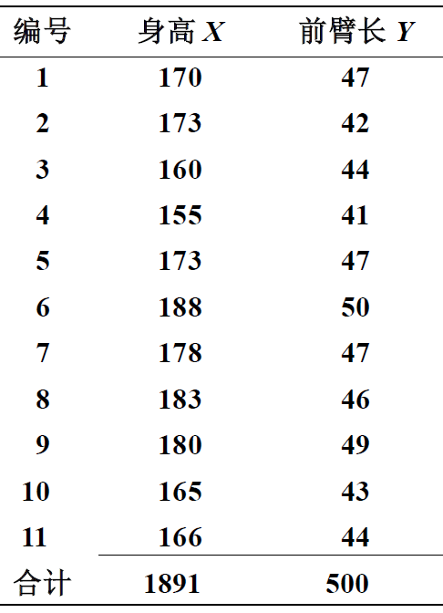
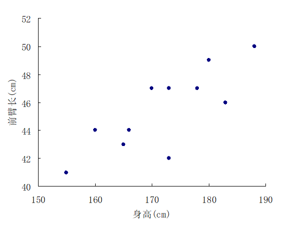
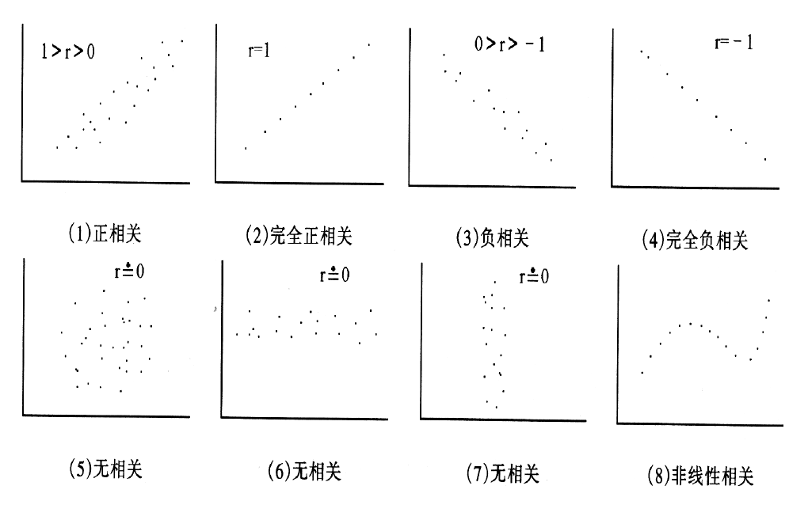
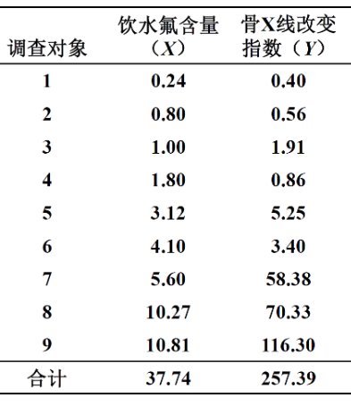
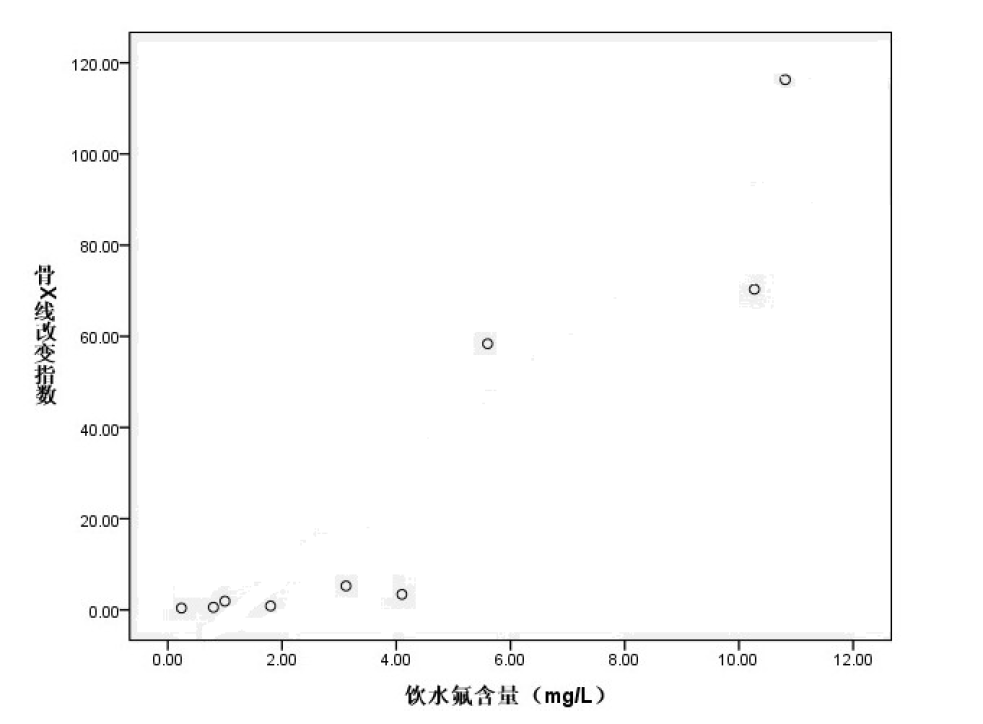
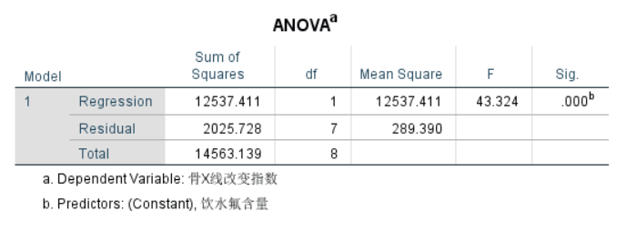
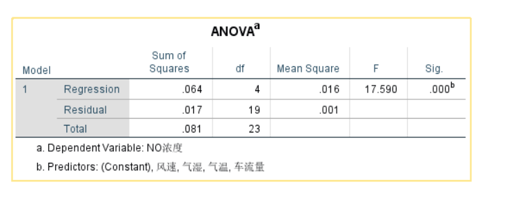

```{r setup, include=FALSE}
options(htmltools.dir.version = FALSE)
```
class: inverse, middle
## 主要内容

- ###相關分析
  - ####簡單相關分析
  - ####spearman秩相關


- ###回歸分析
  - #### 簡單回歸分析
  - #### 多重綫性回歸

---

class: inverse, middle,center


## 簡單相關分析

```{r, out.width = '35%', fig.align='center', echo = FALSE, fig.cap=''}

```


---

>###【例】 根據下表11個成年男青年的身高和前臂長的數據，考慮身高和前臂長的關係。

----

```{r, out.width = '35%', fig.align='center', echo = FALSE, fig.cap=''}

```


---

## 做散點圖
----
```{r, out.width = '85%', fig.align='center', echo = FALSE, fig.cap=''}

```
---
## 簡單相關係數
----


- ### 又稱**Pearson相關係數**，説明具有綫性關係的兩個數值變量閒的密切程度與相關方向的統計量。

### $$r=\frac{\sum_{i=1}^n(x_i-\bar{x})(y_i-\bar{y})}{\sqrt{\sum_{i=1}^n(x_i-\bar{x})^2\sum_{i=1}^n(y_i-\bar{y})^2}}$$
---
## 簡單相關係數的性質
----
- ### 沒有單位，數值的絕對值大小表示相關性强弱
- ### 越接近1表示相關性越强
- ### 約接近0表示相關性越弱

---
### 簡單相關係數示意圖
```{r, out.width = '95%', fig.align='center', echo = FALSE, fig.cap=''}

```
---
## 相關係數的假設檢驗

- ### 計算簡單相關係數： $r=0.8009$
- ### 建立檢驗假設並設定檢驗水平
  - #### $H_0$: $\rho=0$
  - #### $H_1$: $\rho \ne 0$
  - #### $\alpha=0.05$

- ### 計算P值，得出結論
  - #### $P<0.05$，拒絕原假設，在0.05的檢驗水平下認爲前臂長與身高存在綫性相關關係。

---
## Spearman 秩相关检验


- ### 計算秩相關係數： $r_s=0.8009$
- ### 建立檢驗假設並設定檢驗水平
  - #### $H_0$: $\rho_s=0$
  - #### $H_1$: $\rho_s \ne 0$
  - #### $\alpha=0.05$

- ### 計算P值，得出結論
  - #### $P<0.05$，拒絕原假設，在0.05的檢驗水平下認爲前臂長與身高存在秩相關關係。

---
class: inverse, center, middle
## 簡單回歸分析

```{r, out.width = '35%', fig.align='center', echo = FALSE, fig.cap=''}

```
---

###$$\hat{Y}=a+bX$$
- ### $X$: 自變量、解釋變量
- ### $Y$: 因變量、應變量、被解釋變量
- ### $\hat{Y}$: 因變量的預測值
- ### $Y-\hat{Y}$: 殘差
- ###  $a$: 截距項、常數項
- ### $b$: 回歸係數


---


>###【例】 根據下表研究飲水氟含量與骨X綫改變指數的關係。


```{r, out.width = '45%', fig.align='center', echo = FALSE, fig.cap=''}

```

---

## 畫散點圖

```{r, out.width = '85%', fig.align='center', echo = FALSE, fig.cap=''}

```

---
## 估計回歸方程

----
- ### 利用最小二乘原理: 殘差平方和最小

- ###$$\hat{Y}=-13.409+9.94X$$

- ### 得到樣本方程，總體是否有回歸關係?

- ### 假設檢驗
---
## 回歸方程的假設檢驗
- ### 建立檢驗假設並設定檢驗水平
  - #### $H_0$: $\beta=0$
  - #### $H_1$: $\beta \ne 0$
  - #### $\alpha=0.05$
- ### 計算卡方檢驗統計量: 方差分析

```{r, out.width = '65%', fig.align='center', echo = FALSE, fig.cap=''}

```

---
class: middle

- ### 計算P值，得出結論
  - ### $P<0.05$，拒絕原假設，原回歸方程有統計學意義。

---

## 簡單回歸的其他問題

- ### 方程的整體擬合情況： 決定係數 $R^2$
- ###  決定係數跟簡單相關係數的關係
- ### 单个系数的假设检验
- ### 回歸分析的假定條件條件

---

class: inverse, middle, center

#多重綫性回歸

---

>  【例】為研究大氣污染物一氧化氮（NO）的濃度是否受到汽車流量、氣候狀況等因素的影響，選擇24個工業水平相近的城市的一個交通點，統計：
- 單位時間過往的汽車數（千輛）:X1
- 同時在低空的相同高度測定了該時間段平均氣溫（℃）:X2
- 空氣濕度（%）:X3
- 風速（m/s）:X4
- 空氣中一氧化氮（NO）的濃度（ppm）:Y


---
class: center, middle, inverse

# 如何做多重線性回歸？

---
## 確認自變量與因變量的綫性關係


---
##第一步：估計

$$\hat{Y}=\beta_0+\beta_{1}X_{1}+\beta_2X_2+\beta_3X_3+\beta_4X_4$$
.pull-left[

]

.pull-right[
结果：


]

---
## 估計結果

$$\hat{Y}=-0.142+0.116\times X_1+0.004\times X_2+0.000006552\times X_3-0.035\times X_4$$

###估計方法：<span style="color: red;">最小二乘法</span>
###最小二乘法：殘差平方和最小

---

## 第二步：檢驗

###1. 檢驗整個方程是否有意義

###2. 檢驗每一個偏回歸係數是否有意義

---

## 检验方程是否有统计学意义？

.pull-left[
- 第一步：建立 $H_0$ 和 $H_1$.
  - $H_0$： $\beta_1=\beta_2=\beta_3=\beta_4=0$
  - $H_1$： 至少有一個 $\beta_i\ne 0$.
    - $\alpha=0.05$

- 第二步：F統計量见右边方差分析表，在 $H_0$成立的條件下，$F$統計量服從自由度。。。
- 第三步：結論，p<0.05，在0.05的檢驗水平下，拒絕 $H_0$。。。
]

.pull-right[
方差分析表：

```{r, out.width = '125%', fig.align='center', echo = FALSE, fig.cap=''}

```

]

$$\hat{Y}=-0.142+0.116\times X_1+0.004\times X_2+0.000006552\times X_3-0.035\times X_4$$
---
## 每个偏回归系数是否有统计学意义


- ###注意與一元綫性回歸的區別
- ###標準化偏回歸係數的解釋

---

## 模型評估

- ### 決定係數： $R^2$

- ### 調整的決定係數


---
# 模型選擇

.pull-left[
### spss中：

]
--
.pull-right[
###对应方法：

- 逐步法
- 剔除法
- 后向法
- 前向法


]
---
##前向法的結果


$$\hat{Y}=-0.142+0.116\times X_1+0.004\times X_2-0.035\times X_4$$

---
# 线性模型的假定

- ### 綫性（L）
- ### 獨立性（I）
- ### 正態性（N）
- ### 方差齊性（E）
---
class: inverse, center, middle

# 謝謝大家！

